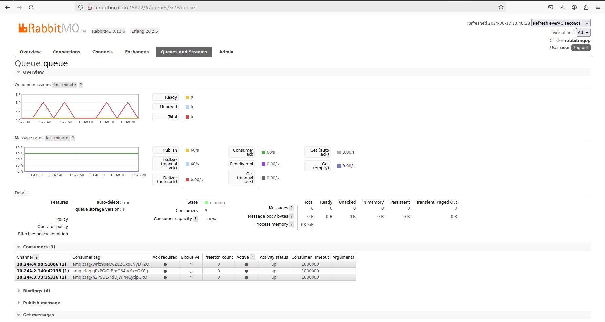

## Setup
1. Create a Kind cluster
```bash
kind create cluster --config kind-config.yaml
```
2. Install Core Components without ingress
```bash
terraform -chdir=build/prod/terraform init && terraform -chdir=build/prod/terraform apply
```

3. Install nginx-ingress
```bash
helm repo add ingress-nginx https://kubernetes.github.io/ingress-nginx
helm install ingress-nginx ingress-nginx/ingress-nginx --version 4.0.5 -n ingress-nginx --create-namespace
```

4. apply kubernetes yaml files
```bash
kubectl apply -f ./build/prod/kubernetes
```

## all components are running and healthy :tada: :tada:
## deployment scaled to maximum replicas :tada: :tada:




# notes
- needed to install nginx-ingress without terraform cause it doesn't generate external ip in local
- i worked with bitnami/rabbitmq image
- needed to edit the user in the rabbittest deployment to 1000 not 10000
- i created keda-rabbitmq-secret and TriggerAuthentication with the scaledobject like the documentation
- i am using http protocol and port 15672 with the scaledobject  to use mode: MessageRate althoug i am using amqp protocol and port 5672 for perf-test
- i made an alias for the localhost as rabbitmq.com and i can reach ingress or any svc using kubectl port-forward


